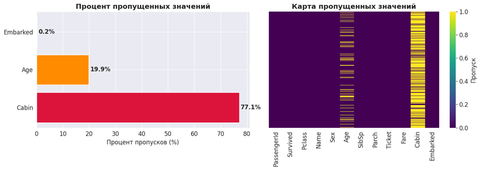
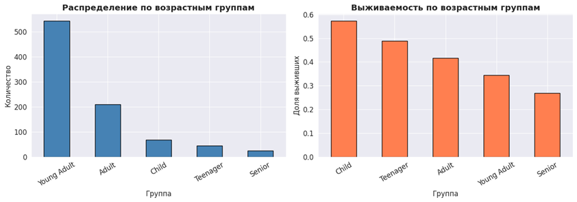
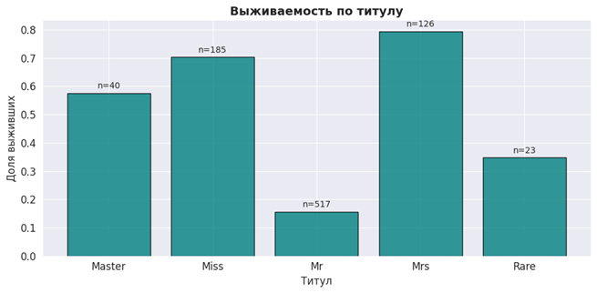
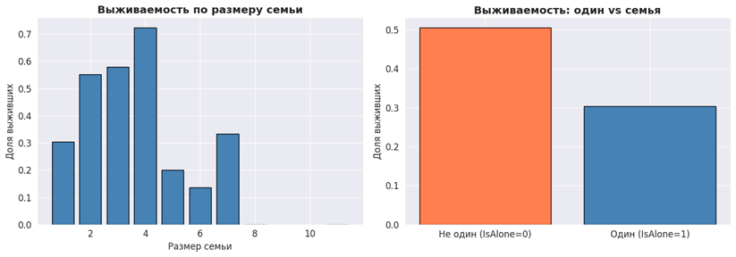
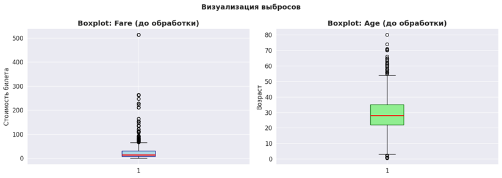
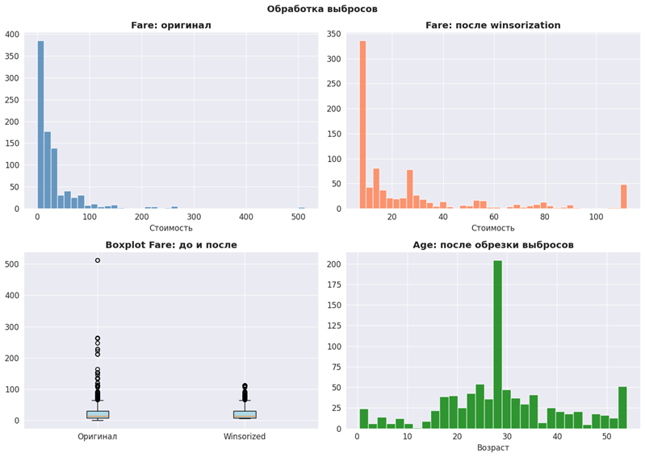
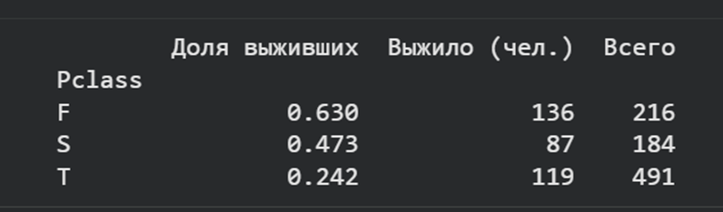
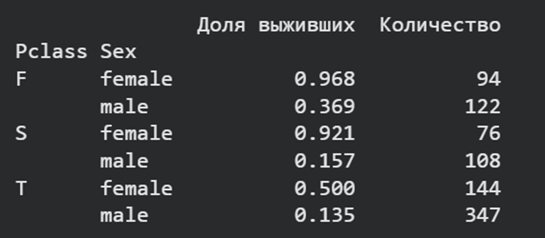
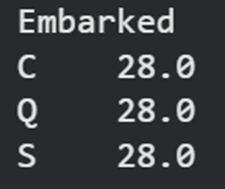
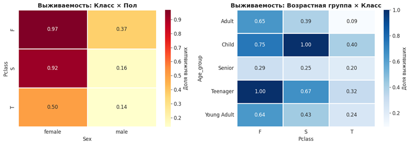

# Лабораторная работа 6

**Тема:** Очистка и трансформация данных. pandas

---

## 1. Цель работы

Освоение методов очистки и трансформации данных с использованием
библиотеки pandas на примере реальных данных из Kaggle.

---

## 2. Описание набора данных

В работе исследуется набор данных **Titanic** (`train.csv`),
содержащий информацию о пассажирах затонувшего лайнера.

- **891 строка** (объектов) и **12 столбцов** (признаков)
- Целевая переменная: `Survived` — флаг выживания (0 — погиб, 1 — выжил)

---

## 3. Первичный анализ данных

### Типы данных столбцов

| Столбец | Тип |
|---------|-----|
| PassengerId | int64 |
| Survived | int64 |
| Pclass | int64 |
| Name | object |
| Sex | object |
| Age | float64 |
| SibSp | int64 |
| Parch | int64 |
| Ticket | object |
| Fare | float64 |
| Cabin | object |
| Embarked | object |

### Статистические характеристики

- `Fare` имеет высокое стандартное отклонение (49.69) при среднем 32.20 — наличие значительных выбросов
- `Age`: среднее (29.70) ≈ медиане (28.00) — относительная симметричность распределения
- Медианы `SibSp` и `Parch` равны нулю — большинство путешествовали без родственников

### Визуализация пропусков

Пропущенные значения обнаружены в трёх столбцах. Построены:
- Горизонтальная столбчатая диаграмма с процентами пропусков
- Тепловая карта пропусков по всему датафрейму

---

## 4. Обработка пропусков

### Age — заполнение медианой

Столбец `Age` содержит **177 пропусков (19.9%)**. Выбрана медиана,
так как она устойчива к выбросам. На основе `Age` создан новый признак
`Age_group` — пять возрастных категорий.

### Embarked — заполнение модой

Столбец `Embarked` содержит **2 пропуска (0.2%)**. Оба заполнены
значением `"S"` (мода).

### Cabin — создание нового признака

Столбец `Cabin` содержит **687 пропусков (77.1%)** — прямое
заполнение нецелесообразно. Извлечена первая буква номера каюты
в новый признак `Cabin_letter`. Пассажирам без каюты присвоена
метка `"Unknown"`. Исходный столбец `Cabin` удалён.

---

## 5. Трансформация данных

### Созданные признаки

**Title** — извлечение титула из имени с помощью регулярного выражения.
Редкие титулы (Lady, Countess, Dr, Capt, Rev, Col и др.)
объединены в категорию `"Rare"`.

**FamilySize и IsAlone**

FamilySize = SibSp + Parch + 1  # сам пассажир
IsAlone = 1 if FamilySize == 1 else 0

Доля одиночных пассажиров — **60.27%** (537 из 891).
Наибольшая выживаемость зафиксирована при `FamilySize = 4`.

### Преобразования типов

**Pclass**: числовой → категориальный строковый

| Значение | Метка |
|----------|-------|
| 1 | F |
| 2 | S |
| 3 | T |

**Sex**: строковый → числовой (в новый столбец `Sex_numeric`)

| Значение | Код |
|----------|-----|
| male | 0 |
| female | 1 |

---

## 6. Обработка выбросов

### Выявленные выбросы

Построены boxplot для `Fare` и `Age`. Для количественного
определения применён метод межквартильного размаха (IQR).

Все выбросы `Fare` сосредоточены в верхней части — максимальное
значение 512.33 превышает верхнюю границу IQR почти в 8 раз.

### Методы обработки

**Winsorization для Fare** — замена значений ниже 5-го и выше
95-го перцентилей на граничные значения.

**Ограничение Age по 95-му перцентилю** — все значения выше 54 лет
заменены на 54.

---

## 7. Агрегация и анализ данных

Выполнены следующие группировки:

- Среднее выживание по классам (`Pclass`)

- Группировка по `Pclass` и `Sex`

- Медианный возраст по портам посадки (`Embarked`)

- Матрица корреляции числовых признаков

---

## 8. Выводы
Результаты работы:
- Выполнена загрузка и проверка типов данных датасета Titanic
- Проведена обработка пропущенных значений тремя методами
- Сформированы новые признаки: `Age_group`, `Title`, `FamilySize`, `IsAlone`, `Cabin_letter`
- Аномальные выбросы стабилизированы с помощью винзоризации
- Построена матрица корреляций и графики распределения выживаемости

Выводы:

Библиотека pandas предоставляет гибкий и мощный инструментарий
для полного цикла подготовки данных к машинному обучению.